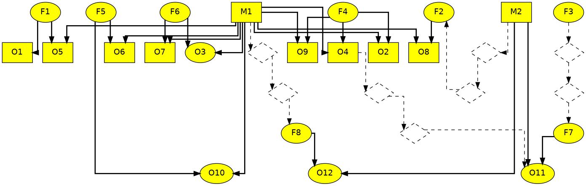

# `relped`

[](https://joss.theoj.org/papers/b5c476c1ce08df5db16410accd7e09de)
[](https://zenodo.org/badge/latestdoi/217557856)
[](https://travis-ci.com/rhagenson/relped)

Relatedness, as a measure of shared genes, ranges from 0.0 (no relation) to 1.0 (exact clones). By considering all pairwise relatedness among a set of individuals an approximate pedigree, or family tree, can be built. In the past, such a pedigree chart was built manually by a compiling expert biologist. `relped` automates building such a pedigree, while allowing the expert biologist to overrule automated inference based on known relationships, parentage, and/or demographics.

## Installation

Before using `relped` there are a few programs you need to install:

+ [Git](https://git-scm.com/downloads): allows you to download `relped`
+ [Go](https://golang.org/dl/): allows you to compile `relped`
+ [Graphviz](https://graphviz.org/download/): allows you to render `relped`'s output

After installing the programs above, getting `relped` installed should be as easy as:

```bash
go get -u github.com/rhagenson/relped
```

## Input

`relped` has one required input, Relatedness, and two optional inputs, Parentage and Demographics.

### Relatedness

Example:

```csv
ID1,ID2,Rel
123,456,0.50
...
```

Note that your columns **must** be named `ID1`,`ID2`, and `Rel`. If your file has duplicate entries of the same ID pair in either order, only the last entry will be used. `Rel` entries may be either a decimal value or one of: `PO`, `FS`, `HS`, `U`, indicating known parent-offspring, full-sibling, half-sibling, or unrelated pair, respectively.

### Parentage

Example:

```csv
ID,Sire,Dam
123,456,789
...
```

Note that your columns **must** be named `ID`,`Sire`, and `Dam`. If your file contains duplicate ID entries, only the last entry will be used. 

`Sire` and `Dam` are used the same as if you had added a `PO` called record into the relatedness input between `ID` and either `Sire` or `Dam` with the additional information of known direction such that `Sire` and `Dam` are plotted above `ID` in the pedigree. Unknown `Sire` and/or `Dam` may be denoted via a `0` or `?` entry.

### Demographics

Example:

```csv
ID,Sex,BirthYear
123,Male,1990
...
```

Note that your columns **must** be named `ID`,`Sex`, and `BirthYear`. If your file contains duplicate ID entries, only the last entry will be used. `Sex` entries of either full word or first letter are recognized (e.g. `M` or `Male`) -- matching is case insensitive.

`Sex` is used to change the formatting attributes in the pedigree to distinguish males, females, and individuals of unknown sex. `BirthYear` is converted to age in the current year under the assumption that all birthdays have passed this year and helps to direct the pedigree so older individuals are plotted above younger individuals.

## Output

`relped` produces a Graphviz-formatted file (directed or undirected, depending on input) with attributes deemed visually appropriate for building pedigrees. Unlike in a typically pedigree, all nodes at the same level in the plot may not be the same age, however all connections will be the same between runs of `relped`.



## Usage

### Producting one plot

A single run of `relped` and Graphviz to produce a pedigree can be done as follows:

```bash
relped build \
    --relatedness <relatedness> \
    --demographics <demographics> \
    --parentage <parentage> \
    --output <output> \
&& dot -Tsvg -O <output>
```

**Important:** How Graphviz plots a pedigree based on a single output from `relped` is not always visually appropriate for presenting your pedigree nework, therefore we recommend building multiple plots at once.

### Producing multiple plots

The below command template can be used to build multiple plots consecutively so that you may pick the most visually appropriate pedigree -- only the layout should change between runs, not the connections therefore all pedigrees should be equal short of visual fitness.

```bash
for run in {1..10}
do
  relped build \
    --relatedness <relatedness> \
    --demographics <demographics> \
    --parentage <parentage> \
    --output $run-<output> \
  && dot -Tsvg -O $run-<output>
done
```

What the above does is loop through the numbers 1-10 (assigning the current number to `run`), then calls `relped` with your inputs (`<relatedness>`, `<demographics>`, and `<parentage>`) and writes multiple output files that are prepended with the run number (`$run-<output>`) -- then it calls Graphviz to produce rendered images in the format stated (note there is no space in `-Tsvg`).

## Contributing

If you find a bug, have a feature request, or otherwise would like to contact the author concerning use of `relped`, please open an [issue](https://github.com/rhagenson/relped/issues).

## License

This work is licensed under the the MIT License, see full terms of use in [LICENSE](./LICENSE) file.
